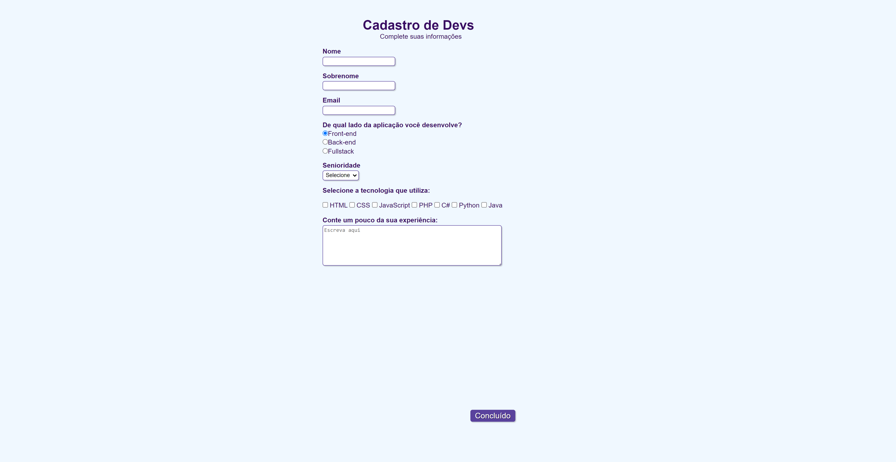

<h1 align="center"> Formulário Dev </h1>

  <a href="#-projeto">Projeto</a>&nbsp;&nbsp;&nbsp;|&nbsp;&nbsp;&nbsp;
  <a href="#-tecnologias">Tecnologias</a>&nbsp;&nbsp;&nbsp;|&nbsp;&nbsp;&nbsp;
  <a href="#memo-licença">Licença</a>

  

## 💻 Projeto

Este projeto foi desenvolvido com o intuito de exemplificar um formulário de cadastro Dev, em que é possível registrar os dados do usuário, bem como suas experiências na area de TI.

_**Veja o resultado [clicando aqui]()**_

## 🚀 Tecnologias 
Esse projeto foi desenvolvido com as seguintes tecnologias:

    - HTML
    - CSS
    - Git e GitHub

## :memo: Licença

Esse projeto está sob a licença MIT. Veja o arquivo [LICENSE](LICENSE) para mais detalhes.

## ✉️ Contatos
    
  
    
   
    
---

Feito com ♥ by Bea :wave: